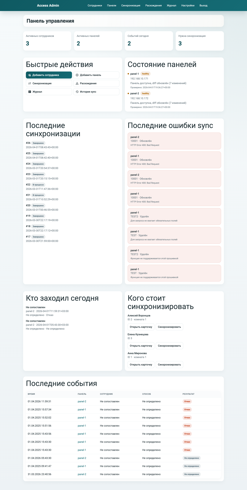
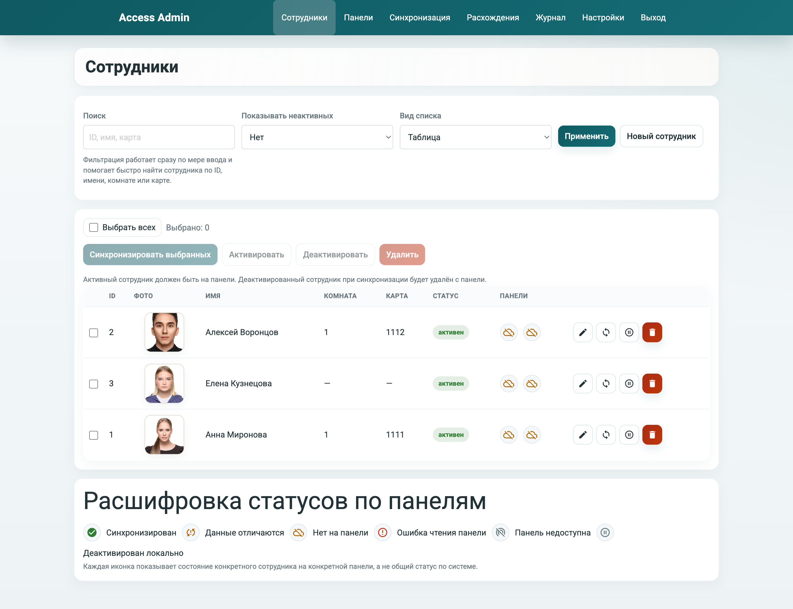
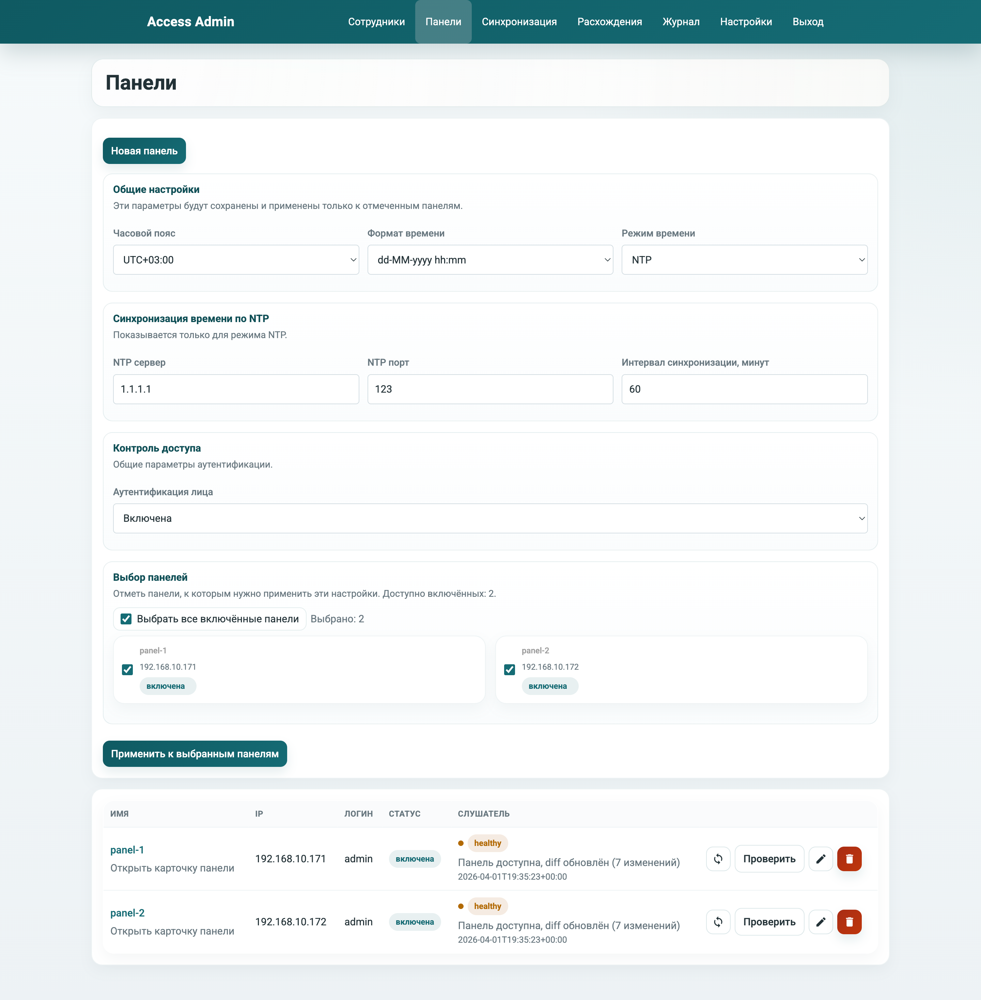
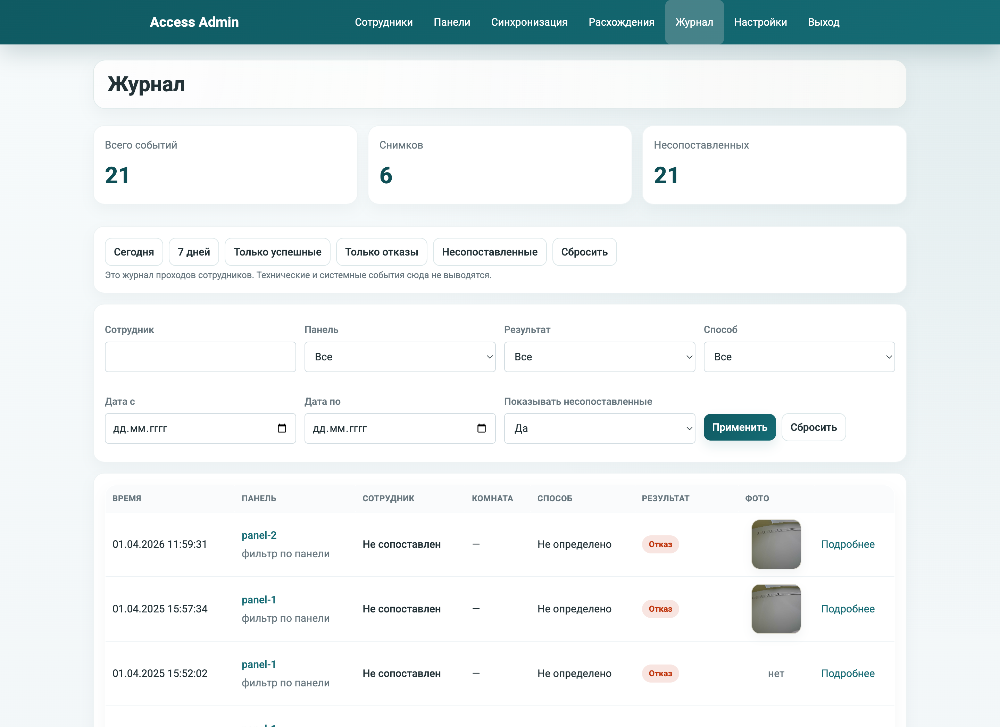

# Hikvision Access Admin

Локальная веб-админка для учета сотрудников и синхронизации данных с панелями Hikvision, протестированная на `DS-KV9503-WBE1`.

## Важно

Этот проект в значительной степени писался с помощью ИИ.

- код не проходил полноценный аудит безопасности;
- проект не тестировался должным образом на использование в чувствительных или критичных средах;
- приложение распространяется `как есть`;
- автор не несёт ответственности за возможные сбои, потерю данных, проблемы безопасности, некорректную работу оборудования или любые иные последствия использования.

Перед реальным использованием рекомендуется провести собственную проверку кода, конфигурации, сетевой доступности и модели угроз.

## Что умеет

- вести сотрудников с фото, картой, комнатой и `employee_id`;
- синхронизировать сотрудников с одной или несколькими панелями;
- показывать diff перед синхронизацией;
- удалять с панели пользователей, которых больше нет в активной локальной базе;
- загружать фото лица;
- хранить журнал проходов со снимками;
- настраивать время панели, `manual / NTP`, формат времени и face auth;
- работать в Docker.

## Для кого это

Проект рассчитан на небольшой объект:

- `2-3` панели;
- около `30` сотрудников;
- локальная установка без сложной корпоративной инфраструктуры.

## Быстрый старт

### Локально

```bash
python3 -m pip install -r requirements.txt
cp config.yaml.example config.yaml
python3 hikvision_admin_app.py --config config.yaml
```

### Docker

```bash
docker compose up -d --build
```

После запуска приложение обычно доступно на:

- `http://127.0.0.1:8080`

## Конфигурация

- пример локального конфига: [config.yaml.example](./config.yaml.example)
- пример контейнерного конфига: [config.docker.yaml](./config.docker.yaml)

Важно перед первым реальным запуском:

- заменить `auth.secret_key`
- заменить пароль администратора
- проверить пути хранения и retention-политику

## Скриншоты

### Главная



### Сотрудники



### Панели



### Журнал



## Документация

Подробные материалы вынесены в [docs/README.md](./docs/README.md):

- обзор системы
- панели и синхронизация
- журнал событий
- архитектура
- схема базы
- конфигурация
- запуск и деплой

## Ограничения

- логика Hikvision зависит от прошивки устройства;
- проект проверялся в первую очередь на `DS-KV9503-WBE1`;
- без HTTPS cookie не помечаются как `Secure`;
- приложение ориентировано на локальную установку и небольшой масштаб.

## Проверка

```bash
python3 -m py_compile hikvision_admin_app.py admin_common.py admin_db.py admin_sync.py hikvision_multi_panel.py smoke_test_admin.py
python3 smoke_test_admin.py
```

## Лицензия

[MIT](./LICENSE)
